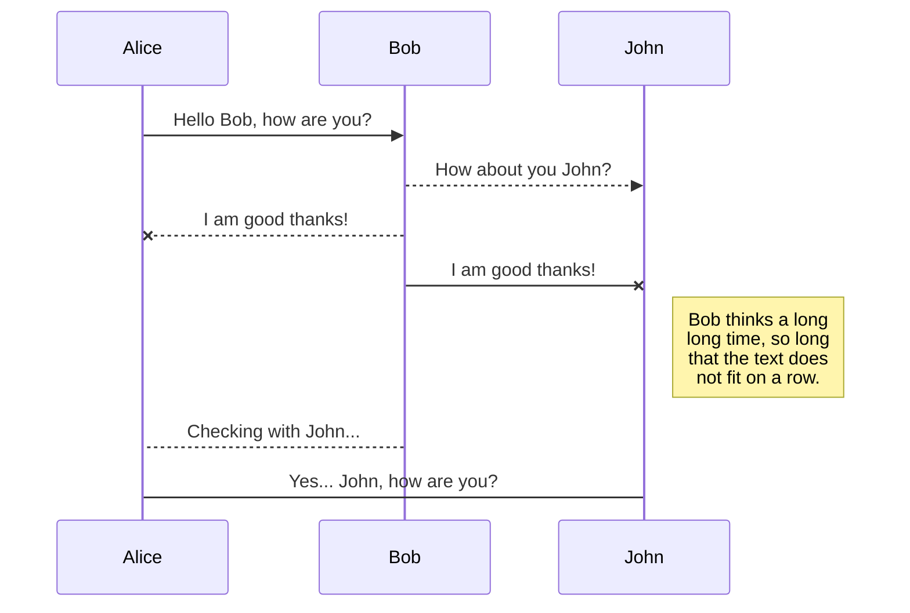

# Nik Loladze's Porftolio
[](https://nodejs.org/en/download/) [](https://www.npmjs.com/get-npm) [](https://remix.ethereum.org/#optimize=false&version=soljson-v0.4.17+commit.bdeb9e52.js) [](https://infura.io/) [](https://web3js.readthedocs.io/en/1.0/) [](https://www.anaconda.com/download/) 

## Kickstarter Solidity Course
_This is a [Kickstarter](https://www.kickstarter.com/) clone where people donate ethereum instead of money. People donate to a decentralized contract on the Ethereum network and then the contract makes requests for spending ether from the contract. All requests must have a majority of contributors approve the request. All transactions are handled through [Metamask](https://metamask.io/), so you must have that installed._


Implementation |Javascript   |	Blockchain  | Design |
|-----|-------------|-------------|--------|--------------------|
|Technology|`Node, Web3, Next, Mocha` | `Infuria, Truffle, Metamask, Solc` | `React, Semantic UI`|

> **The Contract ABI** is our local implementation of a contract done on the remix tester. That contract must be created through a local running instance of Ethereum known as **Ganache CLI**  which connects through a provider, in this case **Infuria** to create the Ethereum contract from the local instance by using **Truffle**. 
> 
> After that, finally we can use **MetaMask** as our portal to connect to our server's portal, **Web3** to connect to Ethereum. This allows for direct interaction with the ethereum network through our **React Front-End** website. Through a browser, we can directly store, pull and add information to the **Ethereum** network.


## To Setup:

1. Clone Repo [Here](https://github.com/dbader/)

2. CD into directory

3. Install dependencies (`npm install`)

4. Run the program (`npm run dev`)

5. Navigate to localhost 3000 (<http://localhost:3000/>)

6. You must have [`MetaMask`](https://metamask.io/) installed or it will not work. All interactions with the contract are done through it.


7. You will have to select the `Rinkeby Test Network` and you will need some "test" ether. You can get test ether from a faucet, such as [faucet.rinkeby.io](https://faucet.rinkeby.io/) or [rinkeby-faucet.com](http://rinkeby-faucet.com/) if you don't want to share social media to get test ether. 

## Directions


* Create `Campaign`, add the minimum amount someone must donate in [Wei](https://bit.ly/2VsrDUs) to join the campaign
 
* You should be returned to the homepage. View your contract from the dropdown.

* You can now contribute to this contract in ether, it will update to show contributions.

* You can view requests by clicking the button "View Requests" in the bottom hand corner of the campaign view. There you'll be able to add requests as the owner of this campaign (and technically contract :smiley:) 
>Recipients are who the ether goes to, theoretically this would be a vendor of sorts to prevent the money or ether actually touching hands of the contract owner. This would mean that whoever would make a kickstart campaign wouldn't ever actually touch the money ideally. A recipient must be a valid ethereum network address to receive the ether. 
* Once a request is added, any contributor can approve and if more than 50% of contributors approve, the request can be approved. 

* `The same person can contribute more than once but their vote only counts as one approval, this is a known error` 


No. 1 Solidity ~ Contracts written in solidity, with three contracts written: a simple Inbox display to screen, a more complex Lottery contract and a sophisticated Kickstarter contract with a factory contract attached to it. Includes a rudimentary Youtube React API and a React implementation of the lottery contract. Details for how to plug in and interact with the Kickstarter contract and API are detailed below.

  

No. 2 Node Blockchain ~ is a complete blockchain; with capabilities to increase difficulty, with a wallet, balance and transaction pool. Allows peers to connect and manually mine blocks. Not integrated with miners however but with POST requests can handle mining of a block and has a shared ledger through the longest chain.

  

No. 3 Python blockchain does not have a transaction pool but implements much the same proof of work as the Node Blockchain (requiring the correct hash with four leading zeros for ease of mining). The Python blockchain manually requires sending transactions through RAW JSON as well as the inputs of the nodes in RAW JSON. Uses Flask to act as an HTTP server, use Postman to interact with the contract. Details below.

  

____________________________________________________________

  

No. 4 ~ My background includes webwork for my cryptocurrency company Ohni, which was started in August of 2017. Relevant links can be found on my resume. The website was an ASP.net pages MVC model. Outdated CSS with no modern front-end tools, somewhat impressive nonethless consider the time put into it.

  

No. 5 ~ This is where I learned to code through repetition in the early 2010s. A Dreamweaver IDE was used to build a PHP site with old school javascript, CSS and HTML. Took 14 months and at one time worked with the Google Maps API. Used Smarty for templating and off the wall images for design. I affectionally call it the Myspace era of coding.

  

Unfortunately I am unable to add the Ruby work I did here back in very early 2013.

  
 

  


```sh

npm install

  

then:

  

npm run dev

  

Navigate to

```

  

Windows:

  

```sh

edit autoexec.bat

```

  

## Usage example

  

A few motivating and useful examples of how your product can be used. Spice this up with code blocks and potentially more screenshots.

  


  

## Development setup

  

Describe how to install all development dependencies and how to run an automated test-suite of some kind. Potentially do this for multiple platforms.

  

```sh

make install

npm test

```

  
  
  

## Meta

  

Your Name – [@YourTwitter](https://twitter.com/dbader_org) – YourEmail@example.com

  

Distributed under the XYZ license. See ``LICENSE`` for more information.

  
  
  

## Contributing

  

1. Fork it (<https://github.com/yourname/yourproject/fork>)

2. Create your feature branch (`git checkout -b feature/fooBar`)

3. Commit your changes (`git commit -am 'Add some fooBar'`)

4. Push to the branch (`git push origin feature/fooBar`)

5. Create a new Pull Request

  

<!-- Markdown link & img dfn's -->

[npm-image]: https://img.shields.io/npm/v/datadog-metrics.svg?style=flat-square

[npm-url]: https://npmjs.org/package/datadog-metrics

[npm-downloads]: https://img.shields.io/npm/dm/datadog-metrics.svg?style=flat-square

[travis-image]: https://img.shields.io/travis/dbader/node-datadog-metrics/master.svg?style=flat-square

[travis-url]: https://travis-ci.org/dbader/node-datadog-metrics

[wiki]: https://github.com/yourname/yourproject/wiki


# Markdown extensions

StackEdit extends the standard Markdown syntax by adding extra **Markdown extensions**, providing you with some nice features.


## SmartyPants

SmartyPants converts ASCII punctuation characters into "smart" typographic punctuation HTML entities. For example:


## KaTeX

You can render LaTeX mathematical expressions using [KaTeX](https://khan.github.io/KaTeX/):

The *Gamma function* satisfying $\Gamma(n) = (n-1)!\quad\forall n\in\mathbb N$ is via the Euler integral

$$
\Gamma(z) = \int_0^\infty t^{z-1}e^{-t}dt\,.
$$

> You can find more information about **LaTeX** mathematical expressions [here](http://meta.math.stackexchange.com/questions/5020/mathjax-basic-tutorial-and-quick-reference).


## UML diagrams

You can render UML diagrams using [Mermaid](https://mermaidjs.github.io/). For example, this will produce a sequence diagram:



And this will produce a flow chart:

