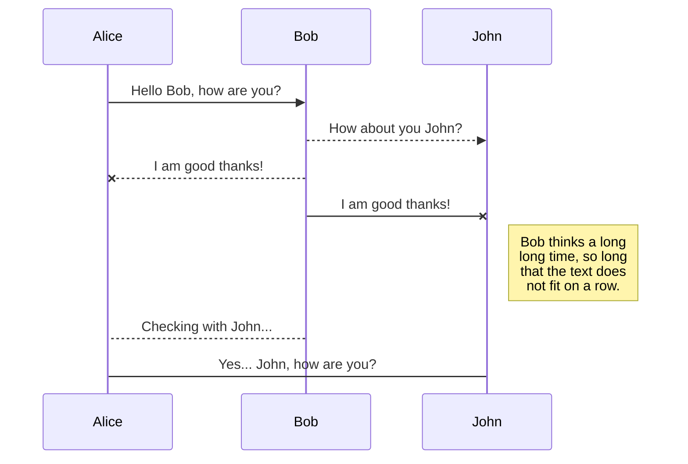

<<<<<<< HEAD

# Nik Loladze's Porftolio
[](https://nodejs.org/en/download/) [](https://www.npmjs.com/get-npm) [](https://remix.ethereum.org/#optimize=false&version=soljson-v0.4.17+commit.bdeb9e52.js) [](https://infura.io/) [](https://web3js.readthedocs.io/en/1.0/) [](https://www.anaconda.com/download/) 

## Kickstarter Solidity Course
_This is a [Kickstarter](https://www.kickstarter.com/) clone where people donate ethereum instead of money. People donate to a decentralized contract on the Ethereum network and then the contract makes requests for spending ether from the contract. All requests must have a majority of contributors approve the request. All transactions are handled through [Metamask](https://metamask.io/), so you must have that installed._


Implementation |Javascript   |	Blockchain  | Design |
|-----|-------------|-------------|--------|--------------------|
|Technology|`Node, Web3, Next, Mocha` | `Infuria, Truffle, Metamask, Solc` | `React, Semantic UI`|

> **The Contract ABI** is our local implementation of a contract done on the remix tester. That contract must be created through a local running instance of Ethereum known as **Ganache CLI**  which connects through a provider, in this case **Infuria** to create the Ethereum contract from the local instance by using **Truffle**. 
> 
> After that, finally we can use **MetaMask** as our portal to connect to our server's portal, **Web3** to connect to Ethereum. This allows for direct interaction with the ethereum network through our **React Front-End** website. Through a browser, we can directly store, pull and add information to the **Ethereum** network.


## To Setup:

1. Clone Repo [Here](https://github.com/dbader/)

2. CD into directory

3. Install dependencies (`npm install`)

4. Run the program (`npm run dev`)

5. Navigate to localhost 3000 (<http://localhost:3000/>)

6. You must have [`MetaMask`](https://metamask.io/) installed or it will not work. All interactions with the contract are done through it.


7. You will have to select the `Rinkeby Test Network` and you will need some "test" ether. You can get test ether from a faucet, such as [faucet.rinkeby.io](https://faucet.rinkeby.io/) or [rinkeby-faucet.com](http://rinkeby-faucet.com/) if you don't want to share social media to get test ether. 

## Directions


* Create `Campaign`, add the minimum amount someone must donate in [Wei](https://bit.ly/2VsrDUs) to join the campaign
 
* You should be returned to the homepage. View your contract from the dropdown.

* You can now contribute to this contract in ether, it will update to show contributions.

* You can view requests by clicking the button "View Requests" in the bottom hand corner of the campaign view. There you'll be able to add requests as the owner of this campaign (and technically contract :smiley:) 
>Recipients are who the ether goes to, theoretically this would be a vendor of sorts to prevent the money or ether actually touching hands of the contract owner. This would mean that whoever would make a kickstart campaign wouldn't ever actually touch the money ideally. A recipient must be a valid ethereum network address to receive the ether. 
* Once a request is added, any contributor can approve and if more than 50% of contributors approve, the request can be approved. 

* `The same person can contribute more than once but their vote only counts as one approval, this is a known error` 


No. 1 Solidity ~ Contracts written in solidity, with three contracts written: a simple Inbox display to screen, a more complex Lottery contract and a sophisticated Kickstarter contract with a factory contract attached to it. Includes a rudimentary Youtube React API and a React implementation of the lottery contract. Details for how to plug in and interact with the Kickstarter contract and API are detailed below.

  

No. 2 Node Blockchain ~ is a complete blockchain; with capabilities to increase difficulty, with a wallet, balance and transaction pool. Allows peers to connect and manually mine blocks. Not integrated with miners however but with POST requests can handle mining of a block and has a shared ledger through the longest chain.

  

No. 3 Python blockchain does not have a transaction pool but implements much the same proof of work as the Node Blockchain (requiring the correct hash with four leading zeros for ease of mining). The Python blockchain manually requires sending transactions through RAW JSON as well as the inputs of the nodes in RAW JSON. Uses Flask to act as an HTTP server, use Postman to interact with the contract. Details below.

  

____________________________________________________________

  

No. 4 ~ My background includes webwork for my cryptocurrency company Ohni, which was started in August of 2017. Relevant links can be found on my resume. The website was an ASP.net pages MVC model. Outdated CSS with no modern front-end tools, somewhat impressive nonethless consider the time put into it.

  

No. 5 ~ This is where I learned to code through repetition in the early 2010s. A Dreamweaver IDE was used to build a PHP site with old school javascript, CSS and HTML. Took 14 months and at one time worked with the Google Maps API. Used Smarty for templating and off the wall images for design. I affectionally call it the Myspace era of coding.

  

Unfortunately I am unable to add the Ruby work I did here back in very early 2013.

  
 

  


```sh

npm install

  

then:

  

npm run dev

  

Navigate to

```

  

Windows:

  

```sh

edit autoexec.bat

```

  

## Usage example

  

A few motivating and useful examples of how your product can be used. Spice this up with code blocks and potentially more screenshots.

  


  

## Development setup

  

Describe how to install all development dependencies and how to run an automated test-suite of some kind. Potentially do this for multiple platforms.

  

```sh

make install

npm test

```

  
  
  

## Meta

  

Your Name – [@YourTwitter](https://twitter.com/dbader_org) – YourEmail@example.com

  

Distributed under the XYZ license. See ``LICENSE`` for more information.

  
  
  

## Contributing

  

1. Fork it (<https://github.com/yourname/yourproject/fork>)

2. Create your feature branch (`git checkout -b feature/fooBar`)

3. Commit your changes (`git commit -am 'Add some fooBar'`)

4. Push to the branch (`git push origin feature/fooBar`)

5. Create a new Pull Request

  

<!-- Markdown link & img dfn's -->

[npm-image]: https://img.shields.io/npm/v/datadog-metrics.svg?style=flat-square

[npm-url]: https://npmjs.org/package/datadog-metrics

[npm-downloads]: https://img.shields.io/npm/dm/datadog-metrics.svg?style=flat-square

[travis-image]: https://img.shields.io/travis/dbader/node-datadog-metrics/master.svg?style=flat-square

[travis-url]: https://travis-ci.org/dbader/node-datadog-metrics

[wiki]: https://github.com/yourname/yourproject/wiki


# Markdown extensions

StackEdit extends the standard Markdown syntax by adding extra **Markdown extensions**, providing you with some nice features.


## SmartyPants

SmartyPants converts ASCII punctuation characters into "smart" typographic punctuation HTML entities. For example:


## KaTeX

You can render LaTeX mathematical expressions using [KaTeX](https://khan.github.io/KaTeX/):

The *Gamma function* satisfying $\Gamma(n) = (n-1)!\quad\forall n\in\mathbb N$ is via the Euler integral

$$
\Gamma(z) = \int_0^\infty t^{z-1}e^{-t}dt\,.
$$

> You can find more information about **LaTeX** mathematical expressions [here](http://meta.math.stackexchange.com/questions/5020/mathjax-basic-tutorial-and-quick-reference).


## UML diagrams

You can render UML diagrams using [Mermaid](https://mermaidjs.github.io/). For example, this will produce a sequence diagram:



And this will produce a flow chart:
=======
<h1 id="nik-loladzes-porftolio">Nik Loladze’s Porftolio</h1>
<p><a href="https://nodejs.org/en/download/"></a> <a href="https://www.npmjs.com/get-npm"></a> <a href="https://remix.ethereum.org/#optimize=false&amp;version=soljson-v0.4.17+commit.bdeb9e52.js"></a> <a href="https://infura.io/"></a> <a href="https://web3js.readthedocs.io/en/1.0/"></a> <a href="https://www.anaconda.com/download/"></a></p>
<hr>
<p></p>
<hr>
<h1 id="kickstarter-solidity-contract">Kickstarter Solidity Contract</h1>
<p><em>This is a <a href="https://www.kickstarter.com/">Kickstarter</a> clone where people donate ethereum instead of money. People donate to a decentralized contract on the Ethereum network and then the contract makes requests for spending ether from the contract. All requests must have a majority of contributors approve the request. All transactions are handled through <a href="https://metamask.io/">Metamask</a>, so you must have that installed.</em></p>
<p></p>

<table>
<thead>
<tr>
<th>Implementation</th>
<th>Javascript</th>
<th>Blockchain</th>
<th>Design</th>
</tr>
</thead>
<tbody>
<tr>
<td>Technology</td>
<td><code>Node, Web3, Next, Mocha</code></td>
<td><code>Infuria, Truffle, Metamask, Solc</code></td>
<td><code>React, Semantic UI</code></td>
</tr>
</tbody>
</table><blockquote>
<p><strong>The Contract ABI</strong> is our local implementation of a contract done on the remix tester. That contract must be created through a local running instance of Ethereum known as <strong>Ganache CLI</strong>  which connects through a provider, in this case <strong>Infuria</strong> to create the Ethereum contract from the local instance by using <strong>Truffle</strong>.</p>
<p>After that, finally we can use <strong>MetaMask</strong> as our portal to connect to our server’s portal, <strong>Web3</strong> to connect to Ethereum. This allows for direct interaction with the ethereum network through our <strong>React Front-End</strong> website. Through a browser, we can directly store, pull and add information to the <strong>Ethereum</strong> network.</p>
</blockquote>
<p></p>
<h2 id="to-setup">To Setup:</h2>
<ol>
<li>
<p>Clone the repo <a href="https://github.com/dbader/">here</a> or alternatively zip the repo.</p>
</li>
<li>
<p>CD into directory, on mac use the Terminal application and check the directory with the <code>ls</code> command. On Windows use the Command Prompt (CMD) and check the current directory with <code>dir</code> command.</p>
</li>
<li>
<p>Once inside the root Kickstarter folder on the selected Bash application, install the necessary dependencies by running <code>npm install</code>. You will need <a href="https://www.npmjs.com/get-npm">NPM</a>.</p>
</li>
<li>
<p>Run the program afterwards by typing <code>npm run dev</code> in the command line.</p>
</li>
<li>
<p>Navigate to localhost 3000 (<a href="http://localhost:3000/">http://localhost:3000/</a>) in your local browser. The project will render there by utilizing a node http server.</p>
</li>
<li>
<p>You must have <a href="https://metamask.io/"><code>MetaMask</code></a> installed or interacting with the application will not work. All interactions with the contract are done through MetaMask. MetaMask is simply a chrome extension for interacting and executing transactions on the Ethereum network.</p>
</li>
<li>
<p>During all prompts, you should see a MetaMask window open up. If you don’t, you’ll need to make sure you openly connected to your MetaMask account, that it is running and you may have to hard restart the page with (ctrl-r). You may have to hard refresh at several pages to either see changes or reset in case a transaction didn’t go through on the blockchain.</p>
</li>
</ol>
<p></p>
<ol start="8">
<li>You will have to select the <code>Rinkeby Test Network</code> and you will need some “test” ether. You can get test ether from a faucet, such as <a href="https://faucet.rinkeby.io/">faucet.rinkeby.io</a> or <a href="http://rinkeby-faucet.com/">rinkeby-faucet.com</a> if you don’t want to share social media to get test ether.</li>
</ol>
<h2 id="directions">Directions</h2>
<ul>
<li>
<p>Create <code>Campaign</code>, add the minimum amount someone must donate in <a href="https://bit.ly/2VsrDUs">Wei</a> to join the campaign</p>
</li>
<li>
<p>You should be returned to the homepage. View your contract from the dropdown.</p>
</li>
<li>
<p>You can now contribute to this contract in ether, it will update to show contributions.</p>
</li>
<li>
<p>You can view requests by clicking the button “View Requests” in the bottom hand corner of the campaign view. There you’ll be able to add requests as the owner of this campaign (and technically contract 😃)</p>
</li>
</ul>
<blockquote>
<p>Recipients are who the ether goes to, theoretically this would be a vendor of sorts to prevent the money or ether actually touching hands of the contract owner. This would mean that whoever would make a kickstart campaign wouldn’t ever actually touch the money ideally. A recipient must be a valid ethereum network address to receive the ether.</p>
</blockquote>
<ul>
<li>
<p>Once a request is added, any contributor can approve and if more than 50% of contributors approve, the request can be approved.</p>
</li>
<li>
<p><code>The same person can contribute more than once but their vote only counts as one approval, this is a known error</code></p>
</li>
</ul>
<hr>
<h1 id="node-cryptocurrency">Node Cryptocurrency</h1>
<p><em>This is a full-scale blockchain implementation. The only difference between this and Bitcoin is the proof-of-work protocol and the automatic calls to mine and replace chains by the longest one. There are also minor security issues but for the most part, this is as complete as a blockchain can be. Of course, there are no miner fees but there is a currency. In order to make POST and GET requests (calls essentially) to the P2P network, you’ll need to have <a href="https://www.getpostman.com/">Postman</a>,  installed.</em></p>
<p></p>

<table>
<thead>
<tr>
<th>Implementation</th>
<th>Javascript</th>
<th>Testing</th>
<th>Cryptographic Libraries</th>
</tr>
</thead>
<tbody>
<tr>
<td>Technology</td>
<td><code>Node, UUID</code></td>
<td><code>Jest, Nodemon</code></td>
<td><code>Elliptic, SHA256, SECP256k1</code></td>
</tr>
</tbody>
</table><blockquote>
<p>We use the <strong>Elliptic</strong> and the <strong>SECP256k1</strong> libraries to sign our transactions with our public key from our private key. The <strong>SHA256</strong> library is of course the basis of all proof-of-work implementations for nearly all currencies. Testing our scripts is done in <strong>Jest</strong> and we use <strong>Nodemon</strong> to automatically restart our Bash terminal upon changes to the library.</p>
<h2 id="to-setup-1">To Setup:</h2>
</blockquote>
<ol>
<li>
<p>Clone the repo <a href="https://github.com/dbader/">here</a> or alternatively zip the repo.</p>
</li>
<li>
<p>CD into directory, on mac use the Terminal application and check the directory with the <code>ls</code> command. On Windows use the Command Prompt (CMD) and check the current directory with <code>dir</code> command.</p>
</li>
<li>
<p>Once inside the root Node Blockchain folder on the selected Bash application, install the necessary dependencies by running <code>npm install</code>. You will need <a href="https://www.npmjs.com/get-npm">NPM</a>.</p>
</li>
<li>
<p>Run the program afterwards by typing <code>npm run dev</code> in the command line.</p>
</li>
<li>
<p>The application should be listening for peers on Port 5000. Now here comes the tricky part… we need other peers to listen and interact with on the blockchain. So open up one  other Bash terminal (whatever you used to run npm run dev with).</p>
</li>
<li>
<p>If on a mac execute the following command.</p>
</li>
</ol>
<pre class=" language-sh"><code class="prism  language-sh">HTTP_PORT=3002 P2P_PORT=5002 PEERS=ws//localhost:5001 npm run dev
</code></pre>
<p>Due to the way Powershell passes commands, on Windows you’ll have to run</p>
<pre class=" language-sh"><code class="prism  language-sh">set HTTP_PORT=3002 &amp;&amp; set P2P_PORT=5002 &amp;&amp; set PEERS=ws://localhost:5001 &amp;&amp; npm run dev
</code></pre>
<h2 id="directions-1">Directions</h2>
<ul>
<li>Let’s start by checking a public wallet address. Open up the <a href="https://www.getpostman.com/"><code>Postman</code></a> app and run a get request <code>localhost:3002/public-key</code> then click send.</li>
</ul>
<p></p>
<ul>
<li>You should receive a 64 string of characters, this is a SHA256 hash and represents peer 3002’s “address” on the blockchain or the second Bash server instance we have running. You can check 3001’s public key as well if you’d like.</li>
<li>Copy that string of characters, open up a second tab in Postman. Change the request in the dropdown from <code>GET</code> to <code>POST</code>.</li>
</ul>
<blockquote>
<p>In the second tab, we’ll get the first client, PORT  3000 to send to PORT 3001 transactions of 50 tokens</p>
</blockquote>
<p></p>
<ul>
<li>
<p>Then in the second tab, type <code>localhost:3001/transact</code> and click the body tag, then click <code>raw</code> since we need to pass variables to the transaction, then in the right-hand drop down menu, click <code>JSON (application/json)</code>.</p>
</li>
<li>
<p>You’re  going to need to paste raw JSON into the body, we’ll sound 50 tokens initially (since all starting wallets come with 500 tokens).</p>
</li>
</ul>
<pre class=" language-sh"><code class="prism  language-sh">{
	"recipient": "the 3002's port public key (address) that you copied
	is pasted here",
	"amount": 50
}
</code></pre>
<ul>
<li>Click send a few times, you should get an output array confirming the original wallet dropping in amounts of 50 tokens with those tokens being sent to the address you specified.</li>
<li>We can easily test if the transactions have been put in the following block to be mined by running a <code>GET</code> request <code>localhost:3002/transactions</code> in a separate tab or <code>localhost:3001/transactions</code> respectively.</li>
</ul>
<p></p>
<ul>
<li>
<p>It’s time to send those transactions in a block ✉️. Let’s mine a block in either one of the Postman tabs or another one, a <code>GET</code> request <code>localhost:3001/mine-transactions</code> or 3002 respectively.</p>
</li>
<li>
<p>You can hit the send button several times for the mine-transactions command, the mining reward is 50 tokens and shouldn’t take more than a few seconds.</p>
</li>
<li>
<p>We can check our wallet balance by conducting another transaction by running our old <code>localhost:3001/transact</code> with the JSON specifying the recipient and amount. You will see that indeed the miner reward does apply to whatever port actually mines the transactions.</p>
</li>
<li>
<p><code>There is no native check wallet balance function unfortunately.</code></p>
</li>
</ul>
<h2 id="uml-diagrams">UML diagrams</h2>
<p>You can render UML diagrams using <a href="https://mermaidjs.github.io/">Mermaid</a>. For example, this will produce a sequence diagram:</p>
<div class="mermaid"><svg xmlns="http://www.w3.org/2000/svg" id="mermaid-svg-3AOOqUoXa9V0Hwm3" height="100%" width="100%" style="max-width:750px;" viewBox="-50 -10 750 457"><g></g><g><line id="actor15" x1="75" y1="5" x2="75" y2="446" class="actor-line" stroke-width="0.5px" stroke="#999"></line><rect x="0" y="0" fill="#eaeaea" stroke="#666" width="150" height="65" rx="3" ry="3" class="actor"></rect><text x="75" y="32.5" dominant-baseline="central" alignment-baseline="central" class="actor" style="text-anchor: middle;"><tspan x="75" dy="0">Alice</tspan></text></g><g><line id="actor16" x1="275" y1="5" x2="275" y2="446" class="actor-line" stroke-width="0.5px" stroke="#999"></line><rect x="200" y="0" fill="#eaeaea" stroke="#666" width="150" height="65" rx="3" ry="3" class="actor"></rect><text x="275" y="32.5" dominant-baseline="central" alignment-baseline="central" class="actor" style="text-anchor: middle;"><tspan x="275" dy="0">Bob</tspan></text></g><g><line id="actor17" x1="475" y1="5" x2="475" y2="446" class="actor-line" stroke-width="0.5px" stroke="#999"></line><rect x="400" y="0" fill="#eaeaea" stroke="#666" width="150" height="65" rx="3" ry="3" class="actor"></rect><text x="475" y="32.5" dominant-baseline="central" alignment-baseline="central" class="actor" style="text-anchor: middle;"><tspan x="475" dy="0">John</tspan></text></g><defs><marker id="arrowhead" refX="5" refY="2" markerWidth="6" markerHeight="4" orient="auto"><path d="M 0,0 V 4 L6,2 Z"></path></marker></defs><defs><marker id="crosshead" markerWidth="15" markerHeight="8" orient="auto" refX="16" refY="4"><path fill="black" stroke="#000000" stroke-width="1px" d="M 9,2 V 6 L16,4 Z" style="stroke-dasharray: 0, 0;"></path><path fill="none" stroke="#000000" stroke-width="1px" d="M 0,1 L 6,7 M 6,1 L 0,7" style="stroke-dasharray: 0, 0;"></path></marker></defs><g><text x="175" y="93" class="messageText" style="text-anchor: middle;">Hello Bob, how are you?</text><line x1="75" y1="100" x2="275" y2="100" class="messageLine0" stroke-width="2" stroke="black" marker-end="url(#arrowhead)" style="fill: none;"></line></g><g><text x="375" y="128" class="messageText" style="text-anchor: middle;">How about you John?</text><line x1="275" y1="135" x2="475" y2="135" class="messageLine1" stroke-width="2" stroke="black" marker-end="url(#arrowhead)" style="stroke-dasharray: 3, 3; fill: none;"></line></g><g><text x="175" y="163" class="messageText" style="text-anchor: middle;">I am good thanks!</text><line x1="275" y1="170" x2="75" y2="170" class="messageLine1" stroke-width="2" stroke="black" marker-end="url(#crosshead)" style="stroke-dasharray: 3, 3; fill: none;"></line></g><g><text x="375" y="198" class="messageText" style="text-anchor: middle;">I am good thanks!</text><line x1="275" y1="205" x2="475" y2="205" class="messageLine0" stroke-width="2" stroke="black" marker-end="url(#crosshead)" style="fill: none;"></line></g><g><rect x="500" y="215" fill="#EDF2AE" stroke="#666" width="150" height="76" rx="0" ry="0" class="note"></rect><text x="496" y="239" fill="black" class="noteText"><tspan x="516" fill="black">Bob thinks a long</tspan></text><text x="496" y="253" fill="black" class="noteText"><tspan x="516" fill="black">long time, so long</tspan></text><text x="496" y="267" fill="black" class="noteText"><tspan x="516" fill="black">that the text does</tspan></text><text x="496" y="281" fill="black" class="noteText"><tspan x="516" fill="black">not fit on a row.</tspan></text></g><g><text x="175" y="319" class="messageText" style="text-anchor: middle;">Checking with John...</text><line x1="275" y1="326" x2="75" y2="326" class="messageLine1" stroke-width="2" stroke="black" style="stroke-dasharray: 3, 3; fill: none;"></line></g><g><text x="275" y="354" class="messageText" style="text-anchor: middle;">Yes... John, how are you?</text><line x1="75" y1="361" x2="475" y2="361" class="messageLine0" stroke-width="2" stroke="black" style="fill: none;"></line></g><g><rect x="0" y="381" fill="#eaeaea" stroke="#666" width="150" height="65" rx="3" ry="3" class="actor"></rect><text x="75" y="413.5" dominant-baseline="central" alignment-baseline="central" class="actor" style="text-anchor: middle;"><tspan x="75" dy="0">Alice</tspan></text></g><g><rect x="200" y="381" fill="#eaeaea" stroke="#666" width="150" height="65" rx="3" ry="3" class="actor"></rect><text x="275" y="413.5" dominant-baseline="central" alignment-baseline="central" class="actor" style="text-anchor: middle;"><tspan x="275" dy="0">Bob</tspan></text></g><g><rect x="400" y="381" fill="#eaeaea" stroke="#666" width="150" height="65" rx="3" ry="3" class="actor"></rect><text x="475" y="413.5" dominant-baseline="central" alignment-baseline="central" class="actor" style="text-anchor: middle;"><tspan x="475" dy="0">John</tspan></text></g></svg></div>
>>>>>>> 09e48911762a45627cf6479a26dadcc2dd3fd227

